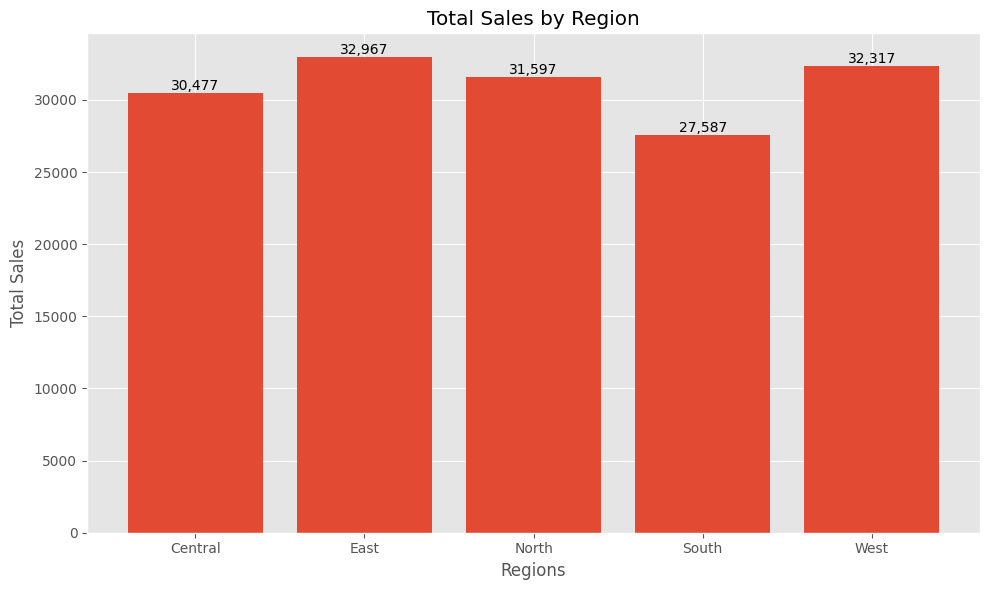
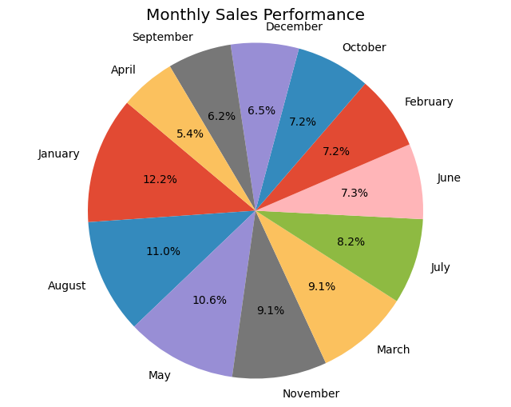

# 📊 Week 5: Advanced Data Manipulation with Pandas
## Project: Customer Sales Analysis


---

## 📌 Project Overview

This project performs an end-to-end customer sales analysis by merging two datasets — `sales_data.csv` and `customer_data.csv` — on a shared `CustomerID` key. The goal is to uncover actionable business insights including regional performance, top customers, product trends, monthly revenue distribution, and customer churn impact on total revenue. The analysis culminates in pivot tables, grouped aggregations, and multiple matplotlib visualisations.

---

## 📁 Files & Structure

```
WEEK 5/
│
├── data/
│   ├── customer_data.csv          # Customer demographics, contract, churn info
│   └── sales_data.csv             # Transaction-level sales records
│
├── images/                        # Exported chart images from the notebook
│
├── customer_analysis_report.pdf   # PDF-exported Jupyter Notebook report
├── customer_analysis.ipynb        # Main analysis notebook
├── README.md                      # Project documentation (this file)
└── requirements.txt               # Python dependencies
```

---

## ⚙️ Data Processing Logic

### 1. Loading & Null Check
Both CSVs are loaded with `pd.read_csv()`. A null-value audit (`isna().sum()`) confirmed **zero missing values** in both datasets — no imputation or dropping was required.

### 2. Column Renaming for Merge Compatibility
The sales dataset used `Customer_ID` while the customer dataset used `CustomerID`. Before merging, the column was renamed to align the key:
```python
sales_df = sales_df.rename(columns={'Customer_ID': 'CustomerID'})
```

### 3. Inner Merge on CustomerID
The two datasets were joined using an inner merge:
```python
merged_df = sales_df.merge(customer_df, on='CustomerID')
```
The resulting merged DataFrame contains **500 rows × 16 columns**.

### 4. Date Column Parsing & Month Extraction
The `Date` column was parsed from string to datetime and a new `monthname` column was derived for monthly aggregation:
```python
mdf['Date'] = pd.to_datetime(mdf['Date'])
mdf['monthname'] = mdf['Date'].dt.month_name()
```

### 5. Metric Calculations
The following grouped aggregations were computed:
- **Monthly performance** — total sales grouped by month name
- **Customer total sales** — total revenue per customer, sorted descending
- **Regional sales** — total sales grouped by region
- **Stayed customer sales** — filtered to `Churn == 'No'`, then grouped by customer
- **Best-selling product per month** — grouped by `['monthname', 'Product']`, top entry per month extracted via `drop_duplicates()`

---

## 📈 Extracted Insights

---

### 🏆 Top 3 Customers by Total Sales
_(Source: "Top 5 Customers by Total Sales" horizontal bar chart)_

| Rank | Customer Name     | Total Sales |
|------|-------------------|-------------|
| 1    | Emily Martin      | $4,960      |
| 2    | William Garcia    | $3,570      |
| 3    | Raymond Robinson  | $3,300      |

> Frank Kim ($3,230) and Emily Smith ($3,190) round out positions 4 and 5.

---

### 📅 Highest-Selling Month
_(Source: "Monthly Sales Performance" pie chart)_

**January** was the highest-revenue month, accounting for **12.2%** of total annual sales — the single largest slice of the pie. August followed at 11.0%, and May at 10.6%.

---

### 🗺️ Best-Performing Region by Total Sales
_(Source: "Total Sales by Region" bar chart)_

| Region  | Total Sales |
|---------|-------------|
| **East**    | **$32,967** ✅ Highest |
| West    | $32,317     |
| North   | $31,597     |
| Central | $30,477     |
| South   | $27,587     |

The **East region** led all regions with **$32,967** in total sales. The South region recorded the lowest at $27,587.

---

### 🔄 Churn vs. Retention by Contract Type

| Contract Type    | Stayed (No) | Churned (Yes) | Churn Rate |
|------------------|-------------|---------------|------------|
| Month-to-month   | 30          | 21            | ~41%       |
| One year         | 15          | 16            | ~52%       |
| Two year         | 12          | 6             | ~33%       |

**Key observations:**
- **Month-to-month** contracts have the highest raw churn count (21 customers churned).
- **One year** contracts show the worst churn rate at ~52% — more churned than stayed.
- **Two year** contracts are the most stable, with a churn rate of only ~33%.
- The overall **Total Revenue Retention Rate is 59.34%**, meaning ~40.66% of potential revenue was lost to churned customers.

---

### 🛍️ Best-Selling Product (Monthly)

**Fiber Optic Setup** dominated sales in **10 out of 12 months**, topping in January at $12,199.39. The only exceptions were **April** and **December**, where **Security Camera** led with $4,029.69 and $4,159.68 respectively.

---

### 💼 Total Charges by Contract Type
_(Source: Pivot table — `contract_value_pivot`)_

| Contract Type    | Total Charges  |
|------------------|----------------|
| Month-to-month   | $102,415.59    |
| One year         | $89,257.09     |
| Two year         | $42,889.64     |

Despite having the highest churn risk, month-to-month customers generate the most total revenue — highlighting a critical retention vs. revenue trade-off.

---

<div align="center">
  <h3>Visual Insights</h3>
  
  
  <br>
  
  
</div>

---

## 🛠️ Technical Stack

| Tool / Library | Purpose |
|----------------|---------|
| **Python 3.x** | Core programming language |
| **Pandas** | Data loading, merging, groupby aggregations, pivot tables |
| **Matplotlib** | Bar charts, horizontal bar charts, pie charts |
| **NumPy** | Underlying numerical operations (used implicitly via Pandas) |
| **Jupyter Notebook** | Interactive development and reporting environment |

---

---

## Final Verdict & Business Recommendations

Based on the comprehensive analysis of sales performance and customer retention metrics, the following strategic recommendations have been developed to optimize revenue and market stability:

### 1. Product Dominance & Portfolio Scaling
The **Fiber Optic Setup** has demonstrated exceptional market fit, securing the "Best Selling Product" title in 10 out of 12 months. This consistent performance indicates a highly effective sales funnel or high market demand for this specific SKU.
* **Action:** Conduct a deep-dive "Winner's Analysis" on the marketing and pricing strategy used for Fiber Optic Setup. 
* **Strategy:** Implement a **cross-training program** for the sales teams handling lower-performing products (e.g., Security Cameras, Tech Support) to replicate the messaging and promotional tactics that drove Fiber Optic's success.

### 2. Regional Optimization & Market Expansion
Analysis of regional distribution reveals a highly competitive performance in the **East ($14,029)** and **West ($13,445)** sectors. Conversely, the **South region** significantly underperforms, trailing the leader by over **$5,000**.
* **Action:** Address the "Revenue Gap" in the South region.
* **Strategy:** Launch a targeted **Regional Growth Campaign** in the South. This should include localized promotions and a competitive analysis to determine if the $5,000 deficit is due to lower brand awareness or aggressive local competitors. Reallocating a portion of the marketing budget from the saturated East/West markets to the South could yield a higher Return on Investment (ROI).

---
*Analysis prepared by [Mohith-151](https://github.com/Mohith-151)*

---

## 📄 License

This project is part of a structured data analytics learning programme (Week 5 — Advanced Data Manipulation with Pandas).